I love to travel and get to know new countries, no doubt about it. So do my
friends. The fresh food, all the novelty, and new places to check out, it's
dope. But one of the most significant issues, while amusing, is that we don't
always know what people say. Duolingo and apps like that are fun, but it feels
like much of the stuff you learn in them isn't that important for talking to
people. Kinda feels like we should just cut out the bullshit and focus on the
most popular words so we can communicate with people as quickly as possible. I
decided to build a mobile app to see if I could accomplish a working demo.

Mafer (my girlfriend), my friend Jason, and I put our heads together to see what
we could come up with. Jason had the initial idea, so we analyzed his vision,
and he put together a wireframe. From there, Mafer did her work in building a
design from the wireframe and research and making it look pretty. Once she was
done with her magic, it was my turn to step in.

<figure>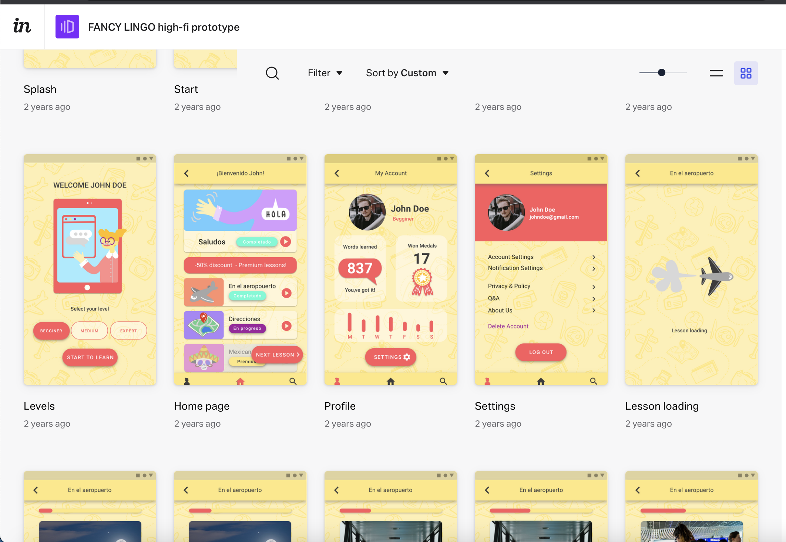</figure>

When I was deciding how to build, I wanted to leverage skills I already had
(Javascript, React) and also to use
[one codebase for both Android and iPhone](https://reactnative.dev/). Since I
had no experience with React Native, I decided to use Expo, to
[build a mobile app as fast as possible](https://expo.dev/). The goal was to
make a working demo of the prospective product that was more built out than an
MVP, which meant having a database of lessons and authentication to control
access to the content.

Since I'm a Front-End developer, I try to optimize my time as much as possible
regarding Back-End processes. The current tools available in the cloud to
replicate these activities are unbelievable, so I went in that direction. I
utilized Firebase first
[to authenticate users](https://firebase.google.com/products/auth) through
Facebook, Google, and email. I found it somewhat tedious to implement for the
first time on mobile, but once I figured it out, it was pretty straightforward.
I could utilize React hooks to
[seperate re-usable logic](https://reactjs.org/docs/hooks-intro.html) and to
[take care of the different authentication API calls](https://github.com/jtbitt/fancylingo/blob/main/src/hooks/useFirebase.ts).

<figure>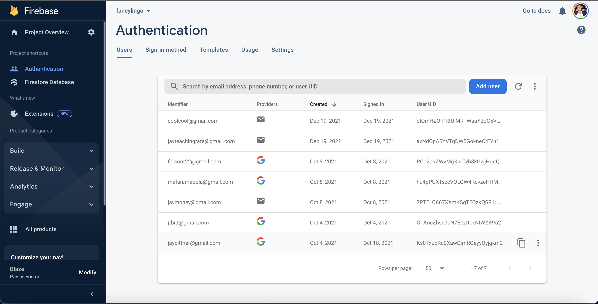</figure>

I was already invested in Firebase, their
[Cloud Storage](https://firebase.google.com/products/storage) made a lot of
sense to handle the storage of the lesson images, flashcard images, and
flashcard audio. I split up the 3 different media types into separate buckets in
the cloud. I kept the naming straightforward as I knew I would need to add these
corresponding values in the database later with the rest of the lesson data.

<figure>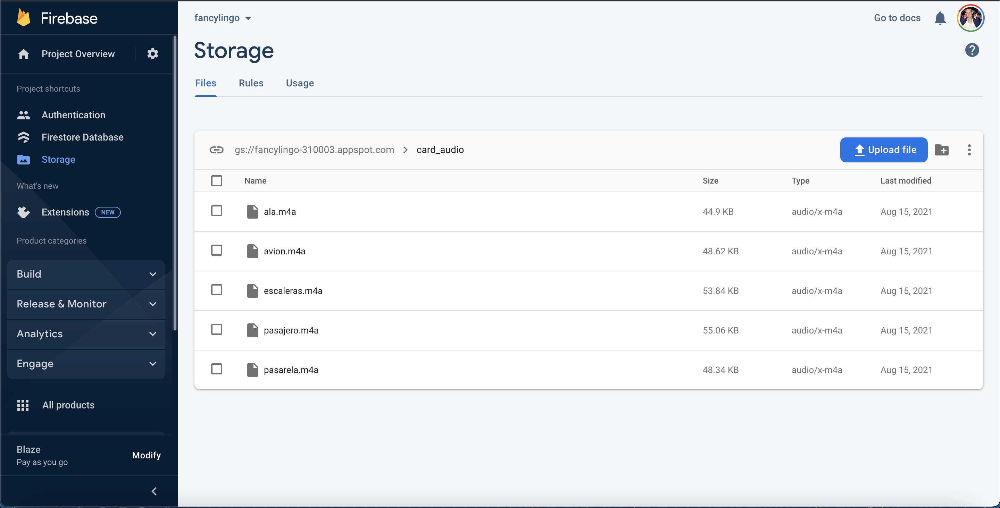</figure>

Following that up, I thought pretty hard about the database. I wanted to use the
NoSQL Firebase database, but it didn't seem to make sense to have organized
lessons and cards. Really felt like a PostgresSQL relational database made much
more sense. I didn't want to build a server just to make a database, so I used
Hasura, [a cloud PostgreSQL database](https://hasura.io/). It gives you all the
features of a relational database and generates RestAPIs and GraphQL so you can
pull the data into your project.

<figure>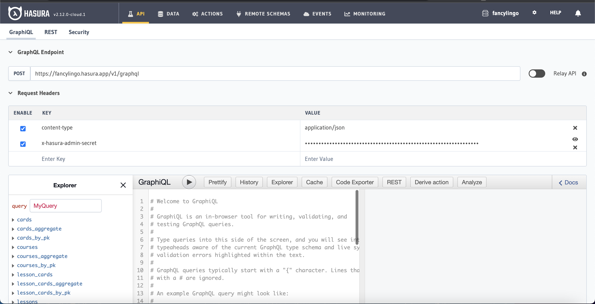</figure>

I created tables for each course (i.e., Spanish), lessons (i.e., Colombian
Slang), cards (i.e., Avion), and lesson_cards (organizes which cards go in each
lesson, which order, etc.) to contain all the data for language content. I also
created user_lessons, so users only have access to the lessons they purchased
and user_cards which are cards that a user specifically saved to practice more.
I created a specific role for authenticated users so they could pull the lesson
data from the database, but then I had another problem; I needed a way to tell
Hasura that each Firebase user was authenticated and allowed to access the data.

<figure>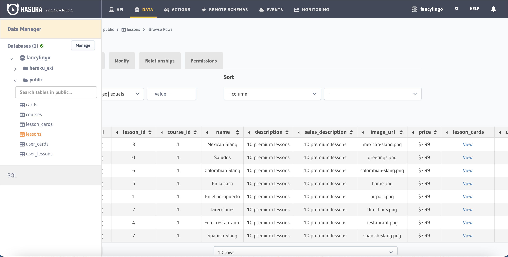</figure>

I went back to searching the documentation to see how I could generate a token
after the Firebase authentication and pass it to Hasura. What ended up being the
solution necessary was to use Firebase cloud functions along with setting up
several env variables to link Firebase with Hasura. The cloud function I created
used Node.js in the cloud and listened for Firebase authentication. On this
authentication, the claims, which are Hasura's way of tracking authenticated
users, were sent to Hasura. The refresh needed to be implemented on the cloud
function; otherwise, the new Hasura claims would not show up in the user object
until a page refresh in the application.

I also gave access to all the lessons to any newly authenticated user by making
a GraphQL mutation query the user_lessons table. If this was a fully built app,
I would do this differently, keeping all these lesson objects in a separate JSON
file or similar idea. Other than a few free lessons, this lesson access would be
triggered and adjusted when a user pays for one of the lessons rather than when
they register.

<Gist gistLink="f91930c353c796bc82b494108942927e" />

The mobile application had a listener in the Auth hook that paid attention to
any changes in the Firebase Auth State. When the state changed, the claims on
the Firebase user were sent to Hasura for verification. If the claim matched in
Hasura, the user, received an auth token that was applied to the global
AuthProvider. If a previously authenticated user already had the token on their
phone, it was synced into the AuthProvider.

<figure>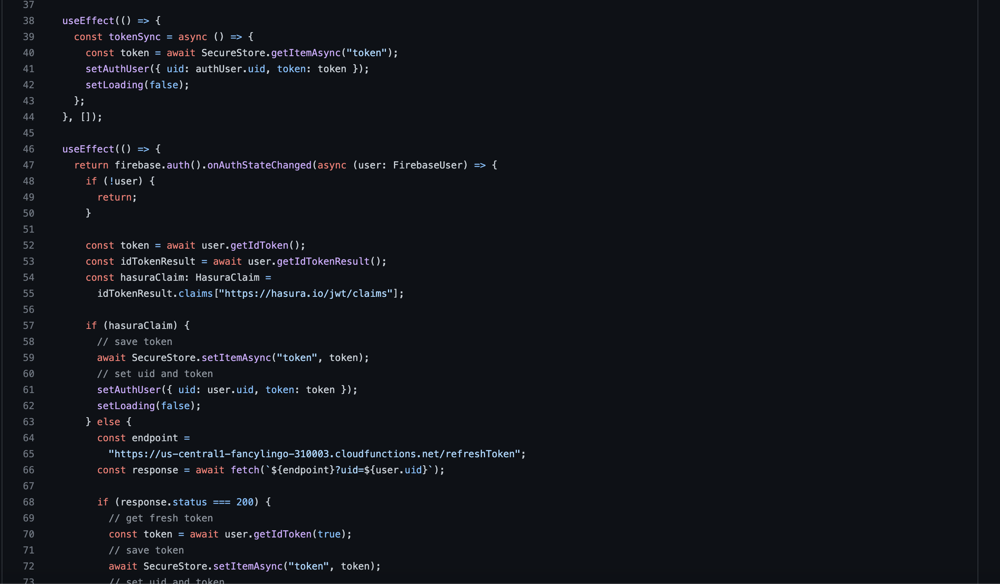</figure>

Once the user got through authentication checks, they were allowed to pass
through the routing into the application. This is the same time Apollo was
allowed to configure GraphQL calls for a specific user, now that they were
verified and had the token.

<figure>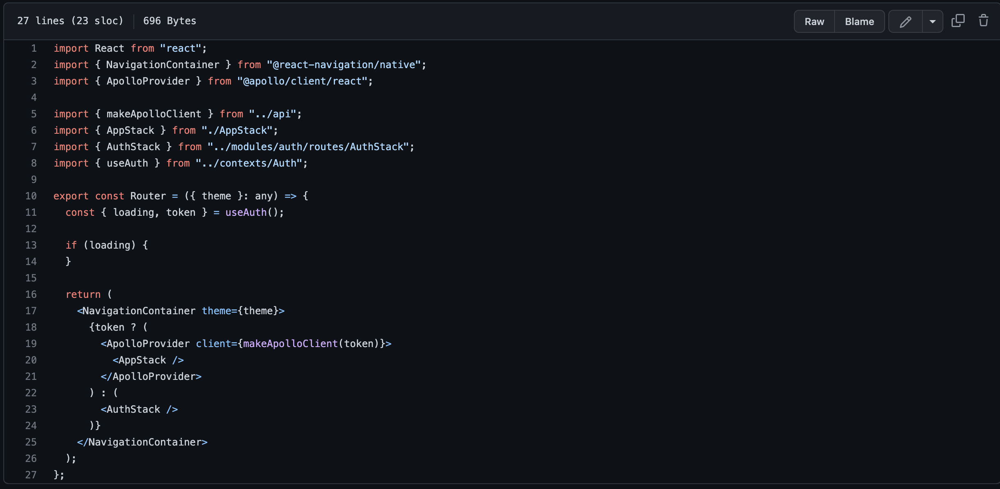</figure>

This token was also used to pull lesson data at various parts of the application
once the user had access. The first thing the user saw was the Lesson List
screen, which initiated a custom useLessons hook. This is also where the lessons
were loaded once retrieved from the hook.

<figure>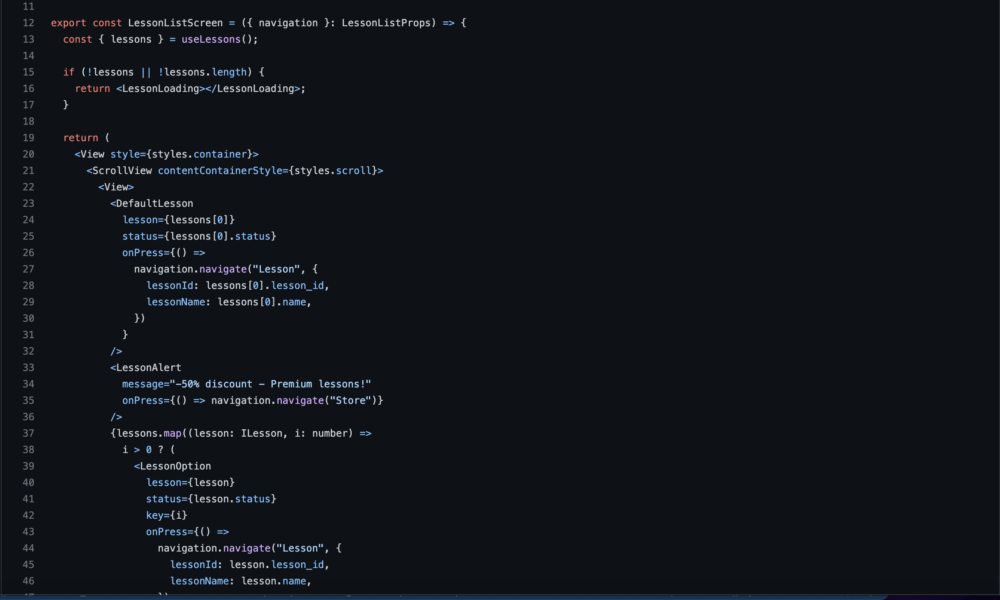</figure>
<figure>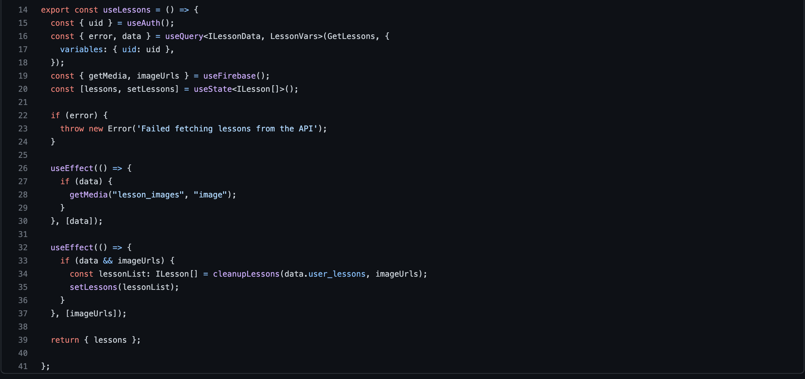</figure>

Within this lessons hook, there was another useFirebase hook utilized where I
pulled the specific images for each lesson that were stored in the PostgreSQL
database. Once I retrieved the pictures from Firebase storage, I merged them
with the other lesson data that was pulled from the Hasura PostgreSQL database
and returned them back to the Lesson List screen for rendering.

<figure></figure>

As you can see, I like hooks and tried to break down all the logic into as many
smaller pieces as possible with specific jobs. This is one snapshot of doing it,
but I used a similar process several times in the application to get different
flashcard data. You can
[see my full implementation](https://github.com/jtbitt/fancylingo) in the code.

Finally, I worked hard to make the UI look great, using CSS-in-JS to
[style the application](https://cssinjs.org) and Flexbox to
[organize the layout](https://web.dev/learn/css/flexbox/). I got it looking good
on all mobile screens and matching the design.

  <figure>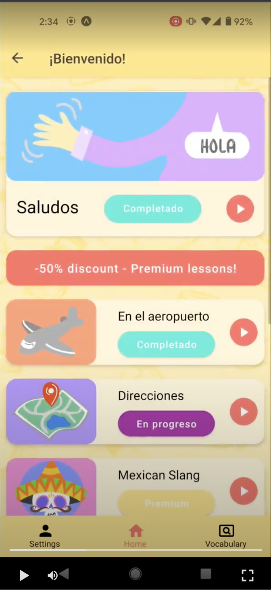</figure>

Overall, I found building a mobile app more time-consuming than building a web
app, as I felt many of the standard tools I used were incompatible with mobile.
The debugging was also relatively more complicated, in my opinion. It may be
because I'm so much more experienced on the web, and my process isn't as
optimized, but a lot of my skills carried over to React Native, which was nice.
It was an exciting challenge, and I'm glad I saw it through to the end.

There wasn't a great way to show off the finished application to all users on
the web for easy access. I was able to deploy it on Expo for Android, but this
option was not available for iPhone, which was not ideal. Also, for the Android
users to view the application they needed the Expo application on their phones
and scan a QR code.

<figure>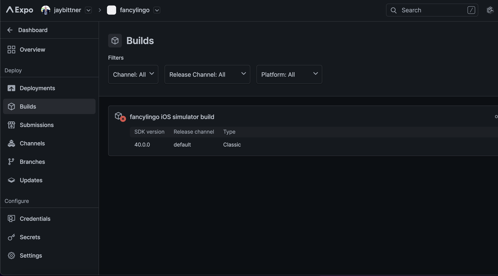</figure>

Some options exist to register for the corresponding app stores and launch a
test deployment. Still, they involved buying licenses and a lot of
configuration, which kind of went against the point to me: to get it out there
and show it to as many people as possible. Expo has an option to deploy to the
web, so I'll put that out there at some point. For now, I did a screen recording
from my Android to show a demo of the application. We've been pretty swamped
with work and haven't pursued this project too hard, but we'd like to at some
point, whether as a mobile app, web app, or web3 iteration.

<MobileVideo url={"/fancylingo.mp4"}></MobileVideo>
