import { Link } from "gatsby";

import { ExternalLink } from "@components";

My focus on coding has been relatively high for quite some time. However, I
haven't had an active site for at least a couple of years, leaving something to
be desired regarding my overall satisfaction with myself. I've been grinding for
a while with my work and other life stuff, and not surprisingly, I've neglected
certain parts of my life. If I'm trying to get my face out there to customers
and other like-minded individuals, it's a massive waste for me not to have
myself out there on the internet. That's why I decided to build out a new
website.

For this project to be worth the effort of building, the design needed to stand
out, look unique, and have a style that represented what I liked. I'm really
into black and prefer an edgier, dark style, so I was aiming for something in
that direction. Design isn't my biggest strength, so I asked my girlfriend,
Mafer, to help put this idea together. She does UX Research for her current job,
so we spent a lot of time researching the ideal customers that I would be after
and formulating a design strategy from there. Once we had figured out all the
critical answers, she put together an excellent design for me to build off of.

<figure>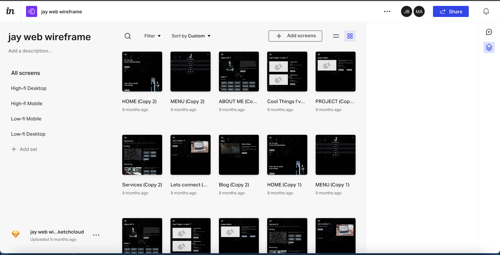</figure>

Once the design wheels were set in motion and taken care of, I needed to get the
code going. <ExternalLink url="https://reactjs.org/">React</ExternalLink>
and&nbsp;<ExternalLink url="https://angular.io/">Angular</ExternalLink> are
great tools, but they aren't optimal for building fast, static websites that
render a lot of HTML content on the initial page load. You can optimize these
tools by implementing different rendering strategies, but it makes a lot more
sense to just use tools that are specifically built for these specific things,
so I looked heavily into<ExternalLink url="https://www.gatsbyjs.com/">
Gatsby</ExternalLink> and <ExternalLink url="https://nextjs.org/">
Next.js</ExternalLink>, which still utilize React but in a very effective way
for speed and SEO. After some deliberation, I went for Gatsby as I've been
interested in it for quite a while and dug all the built-in tools they have set
up. They also have an excellent build platform that is very fast and helpful
during the build process.

<figure>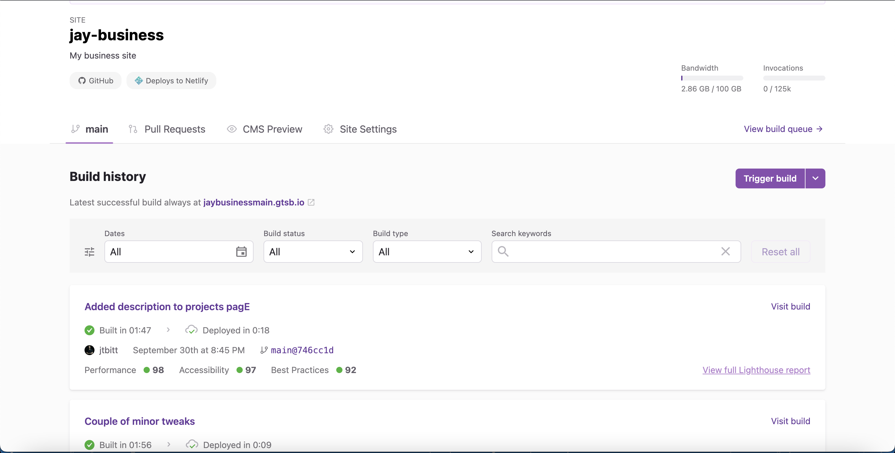</figure>

I also decided to use <ExternalLink url="https://www.netlify.com/">
Netlify</ExternalLink> to host the actual site because they have a great
reputation and some unique tools like backend analytics and great forms that
aren't available on Gatsby hosting. They also have CDN capabilities that serve
your site to the customer as fast as possible, no matter where they are in the
world.

<figure>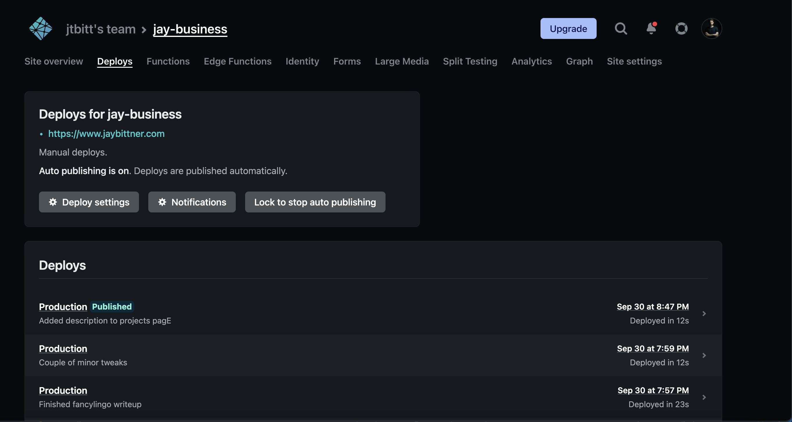</figure>

I started this project like any other, first looking at the design and deciding
how I wanted to break everything up. I usually break up global components, API,
etc., into their own folder and then have module folders for each application
section. I keep anything only used by one module in the module folder rather
than the global one. In the case of Gatsby, pages are generated automatically by
being in the /pages folder specifically. I played around with putting components
into this, but it went against the Gatsby page generator setup. So for this
project, I put all hooks, components, etc., inside a global folder with
corresponding sub-folders based on the page (ex./home). I created all the pages
inside the pages folder.

  <figure>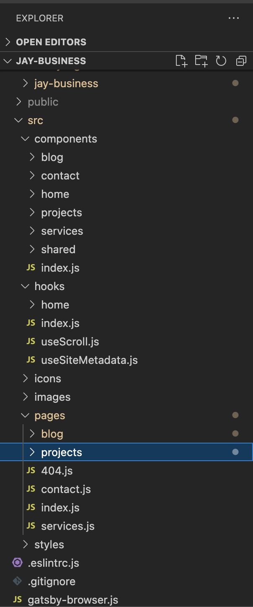</figure>

Once the rough structure was decided, I started building out the skeleton of the
project. Since I really wanted a lot of structure and clean implementation, I
spent a lot of time breaking up my code into small specific components, hooks,
etc., to make it as maintainable and organized as possible, even as the project
grows.

<figure>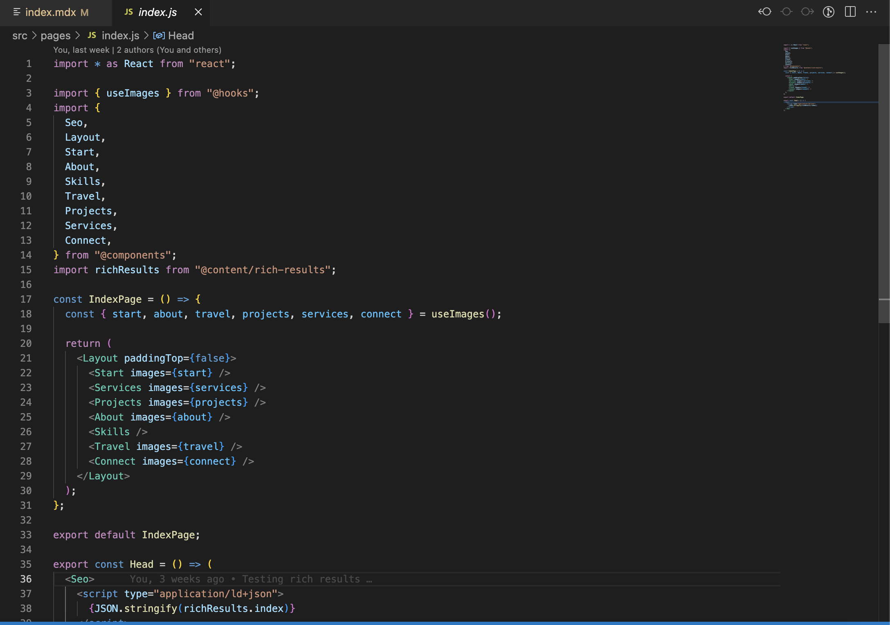</figure>

I also decided to go with <ExternalLink url="https://tailwindcss.com/">
TailwindCSS</ExternalLink> to do all the CSS, as it eliminates a lot of rogue
CSS classes and stylesheets that get annoying and add loading time. It's much
easier to use utility classes you can put directly in HTML with media query
capability to put everything together. Even if someone has never seen your code,
they can easily understand the CSS because Tailwind standardizes it.

<figure>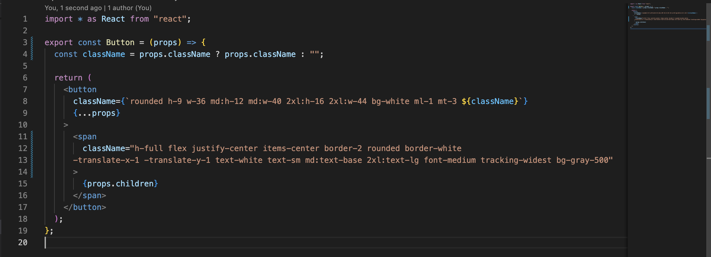</figure>

I started putting things together, slowly polishing up the look, creating copy
to support my call to action, which is to sell my various<Link to="/services/">
coding services</Link>. Everything in my design is based on drawing interest and
giving customers actionable things they can do to use my services. The user is
given several buttons on the landing page, all of which take them to the
services page, where more specific information, prices, and frequently asked
questions are addressed. If the user wants to become a customer, clicking on any
service buttons opens a&nbsp;

<ExternalLink url="https://calendly.com/">Calendly</ExternalLink> modal where they
can set up a call with me. I have a few questions the user needs to answer to filter
for motivated customers.

<figure>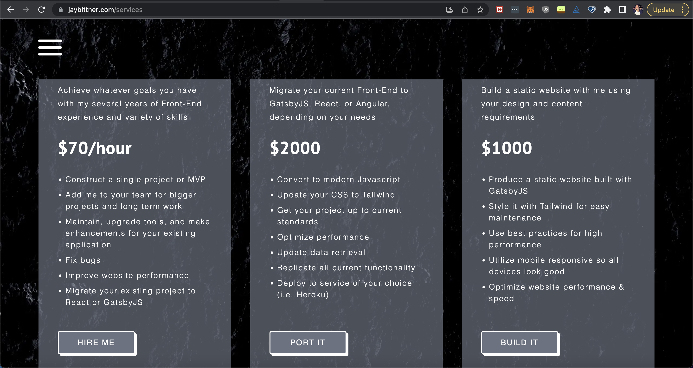</figure>
<figure>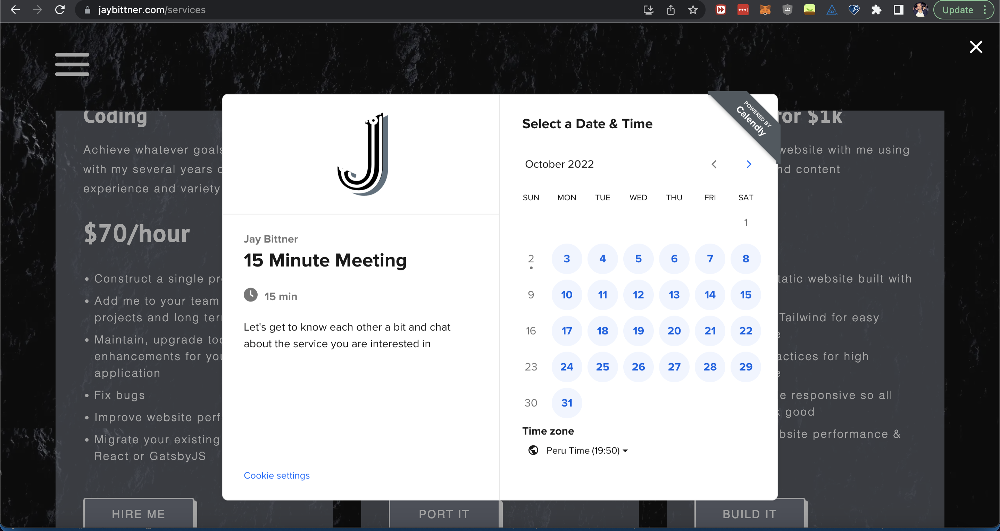</figure>

If the user gets to the bottom of the landing page without following the call to
action, I give them the option to set up a Calendly meeting with me, contact me
by email, or check out the <Link to="/services/">Services</Link> page.
The&nbsp;<Link to="/contact/">contact form</Link> requires the same questions to
be answered as setting up a Calendly meeting. I'm OK with only some customers
getting through the filter because I want serious customers. The contact form
gives the customer another option in case they don't want to make a call. I have
some configuration on the state to derail bots and other spam.

<figure>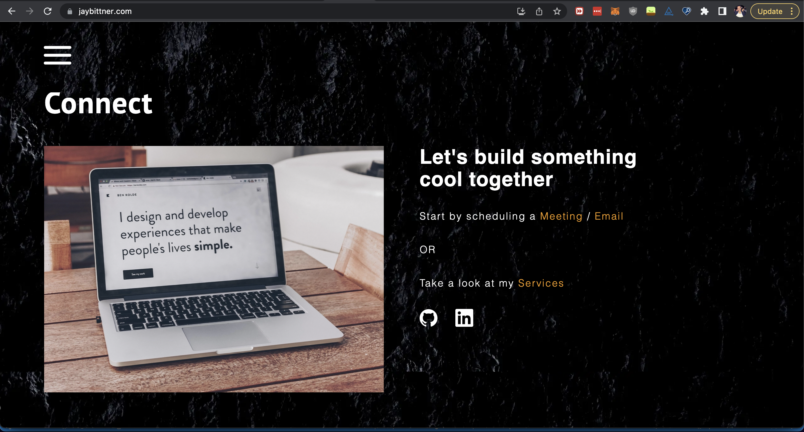</figure>
<figure>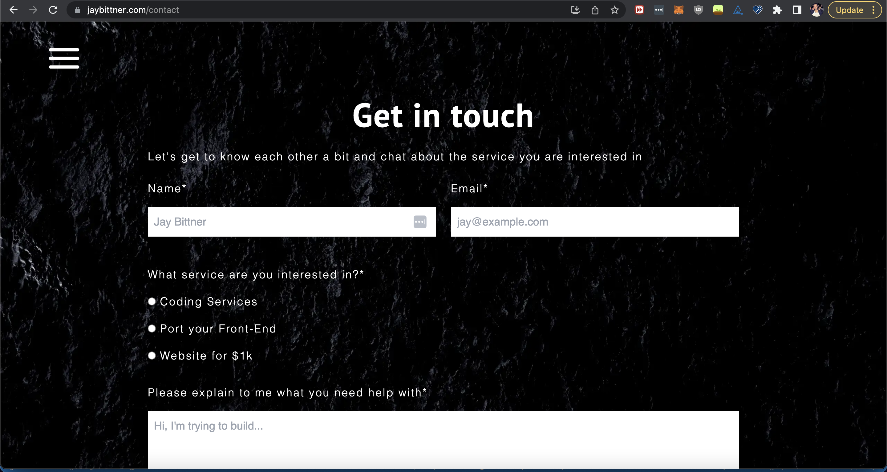</figure>

As I was wrapping up the website, I knew I wanted to set up some 3rd party
scripts to monitor my website activity. In my professional career, using
monitoring tools to help track errors whenever they happen to the end user is an
effective way to lower debug time and point out some red flags. Anything I can
do to minimize the time fixing bugs is a considerable value. I decided to
add<ExternalLink
url="https://sentry.io/welcome/"> Sentry</ExternalLink> because it has a free
tier, and it's been beneficial for me in the past.

<figure>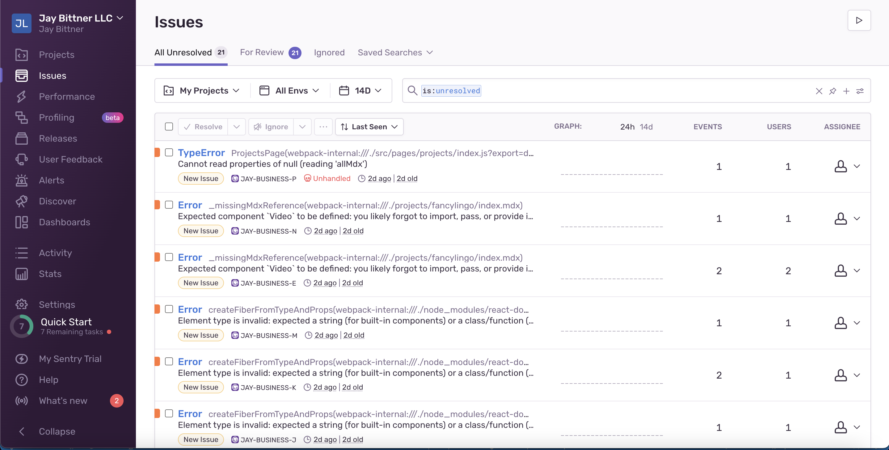</figure>

On top of Sentry, I wanted to add some type of analytics to track my actual
users. Since my site has a specific call to action that needs to happen, I
thought being able to see how my users interact with the site was necessary. I
decided to create a <ExternalLink url="https://www.hotjar.com/">
Hotjar</ExternalLink> account, so I could watch videos to see where my users are
going and check heatmaps to see where they click the most. Hotjar does lower my
website performance score, so I will activate/deactivate it at different points
depending on when I want information. For now, I have it deactivated.

<figure>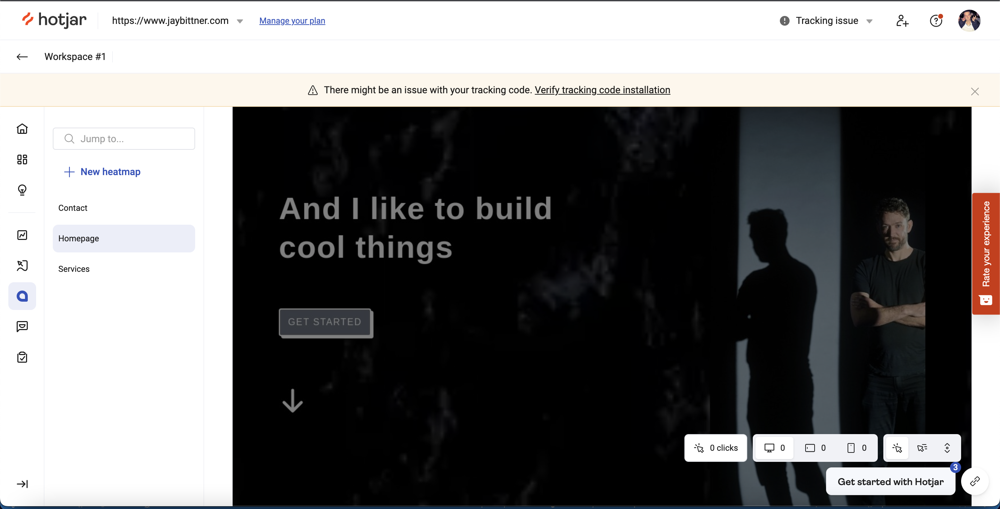</figure>

To keep some standard, no-bullshit analytics, I also wanted to implement
something for that. Google Analytics is free and very effective, but I felt it
was overkill for several reasons for my small business site. First, it is a
heavy script and significantly lowers performance scores. The other thing was
that it's not GDPR compliant, so you're forced to legally show different privacy
popups to your users, which kills the vibe.

I decided to go with an independent GDPR-compliant company called <ExternalLink 
url="https://plausible.io/">Plausible Analytics</ExternalLink> which follows
users on the client side code. I'm currently on the trial version, but it seems
like a no-bullshit platform, which I like. I also have the option to
use<ExternalLink 
url="https://www.netlify.com/products/analytics/"> Netlify server-side
analytics</ExternalLink> since I'm hosting with them, which would give me a
different angle, but I decided to hold off on adding more analytics until I'm
doing the more important thing, which is getting a lot of users on my website.

<figure>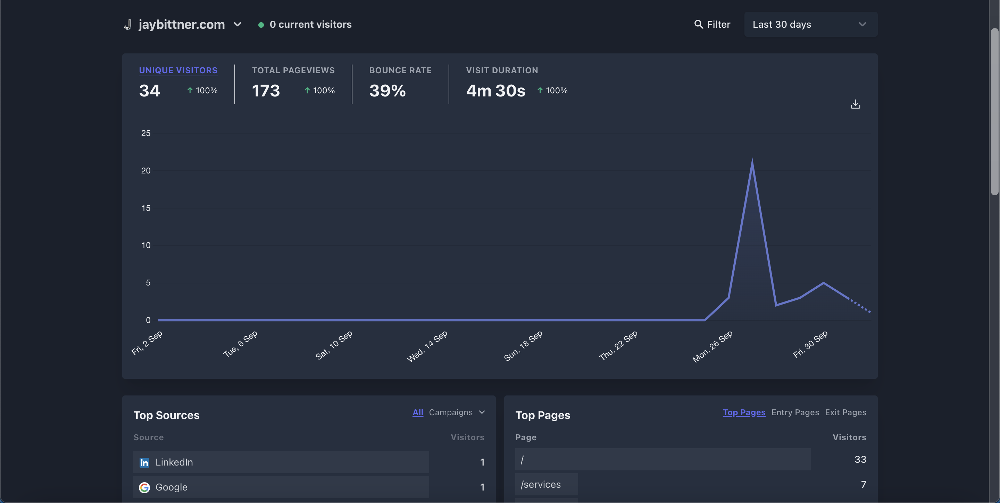</figure>

I did my best to follow Gatsby's best practices and implement unique SEO for all
pages of my website. I'm admittedly not very experienced doing SEO, so this is a
running experiment. Utilizing sites like <ExternalLink 
url="https://ahrefs.com/">ahrefs</ExternalLink> and using <ExternalLink 
url="https://developer.chrome.com/docs/lighthouse/overview/">Google
Lighthouse</ExternalLink> to make sure there aren't any leaks that would lower
my score; it's going to be something that improves progressively over time.
Also, traffic should slowly tick up as I link my content to various sites, talk
on social media, and develop my blog.

And with all the configuration set up, that led me to the last thing I needed:
speed optimization. Typically the biggest speed killer is images. Most From what
I've seen, people do not compress and optimize their images enough. Compressing
images and converting them into modern formats like WebP can cut a ridiculous
amount of loading time. Along with those things, adding lazy loading, not
loading an image until your scroll is near to it on the page, minimizes the
number of images that even need to be loaded initially. Gatsby has
a<ExternalLink 
url="https://www.gatsbyjs.com/plugins/gatsby-plugin-image/"> killer
plugin</ExternalLink> that optimizes your pictures, converts them into modern
formats like WebP, and implements lazy loading. It also creates backups in jpg
or png if the user's browser can't use WebP. Anyone who spends time trying to
minimize loading times knows how essential these types of processors are.

<figure>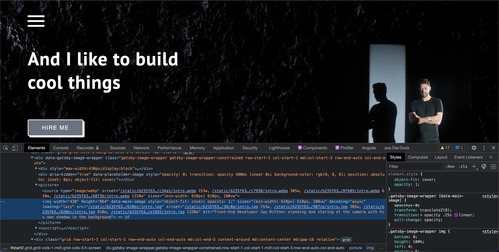</figure>

Along with optimizing images, which I would say is the biggest time saver, it
was vital to minimize the amount of Javascript being run on page load. I've been
on sites where so many API calls and processes are immediately being run that it
kills loading speed. Getting a page to the user as fast as possible is
essential. Other than making a GraphQL query to grab my initial home page images
and to use a Javascript function to re-structure their objects, I avoided making
any different initial Javascript calls on the home page.

With the optimized images and minimal Javascript, my app's performance was 100
on Google Lighthouse, which is the best score you can get. I was really stoked
and pleased with myself. Unfortunately, 3rd party scripts that put things in,
like code tracking and analytics, can slow things down. After I added the
Sentry, Plausible, and Hotjar scripts to my project, my website's score went
from 100 to 94, which was a bummer. I dug in for solutions. The Plausible script
is minimal and meant to be fast, so this wasn't affecting the score. I was
accidentally implementing a very heavy Sentry script, so Instead, I implemented
a very minimal script, which increased my score significantly. Unfortunately,
Hotjar has no lightweight script, so it still had my score at around 96 by
itself.

Gatsby recently set up a Script API that allows you to load your 3rd party
scripts differently. The options are after-page hydration, whenever the main
thread is idle, or by using a new cutting-edge library called <ExternalLink 
url="https://partytown.builder.io/">Partytown</ExternalLink> that runs the
script separately from your application in a service worker, so it doesn't load
in the same place as the rest of the code. The default option of post-hydration
worked for Sentry and Plausible, but unfortunately, with Hotjar, neither of the
first 2 options worked. It was still messing up the performance score, even with
those optimizations. I decided to play around with Partytown to see if I could
make some magic happen.

<figure>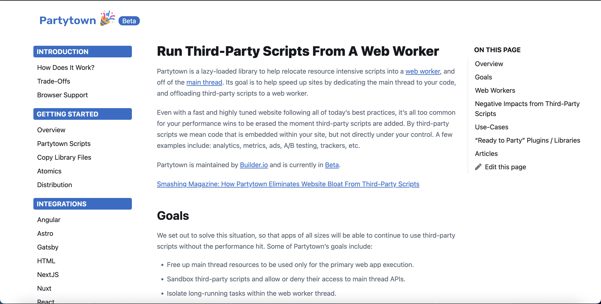</figure>

After grinding away for several hours, I got things configured to load the
Hotjar script separately and get my score back to 100. However, because
Partytown is still experimental, it was still error-prone and not working 100%
of the time. Since breaking the website for any user is too big of a risk, using
Partytown doesn't make sense to me until it evolves. I decided to disable Hotjar
for now but will re-enable it for specific stretches of user tracking when I
need it. With Hotjar disabled, my website performance is sitting at 100, and my
other website markets are also great. Because of my background color and font
color combination, I don't have a perfect accessibility score, but I'm not
willing to change that for a perfect score. All other accessibility is
excellent, screen-reader-wise.

<figure>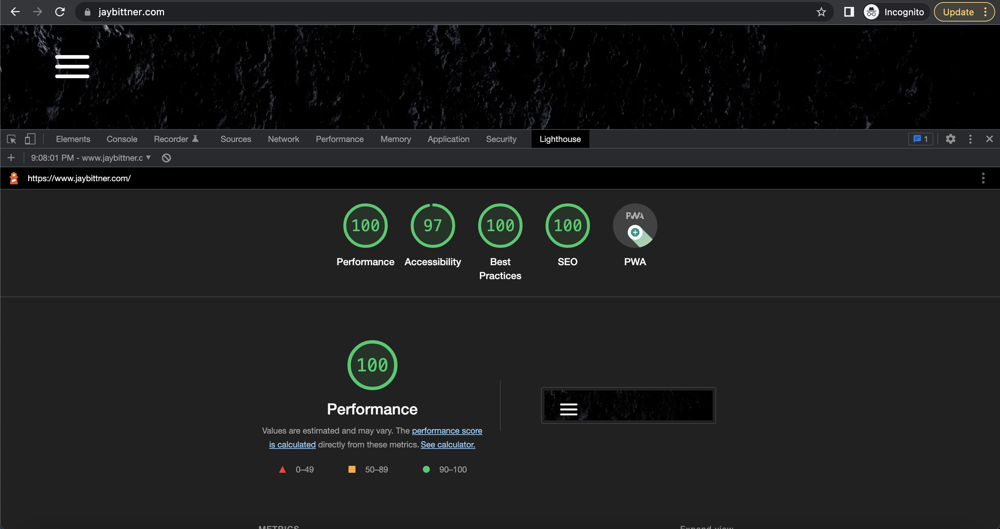</figure>

<Link to="/">This website</Link> is very new and still in the beginning stages. However,
now that it's built out, my work on it going forward will primarily be
<Link to="/projects/fancylingo/">developing project analysis like this</Link>,
creating <Link to="/blog/construction-to-developer">exciting blog content</Link>,
and further developing my SEO. Outside of the site, I need to get customers to my
website, and as I get more and more happy customers, I'll add more testimonials and
examples of the work I've done for them. Nothing is more important to me than a satisfied
customer so I'll keep going hard in the paint on that angle.

<figure className="flex flex-row justify-center">
  <iframe
    width="560"
    height="315"
    src="https://www.youtube.com/embed/bTHH34rCCeU"
    title="YouTube video player"
    frameBorder="0"
    allow="accelerometer; autoplay; clipboard-write; encrypted-media; gyroscope; picture-in-picture"
    allowFullScreen
  ></iframe>
</figure>
